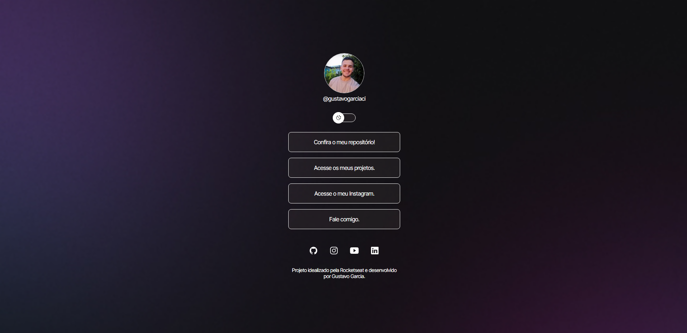

# Social Links

## Preview




## How can I use it?

Clone the project

```bash
  git clone git@github.com:gustavogarciac/devlink-rocketseat.git
```

## 🚀 Technologies

- HTML5
- CSS
- JavaScript

## 💻 Project
This project is a section with links to any social network the user wants to define. In addition, there is a switch to change the theme color.

